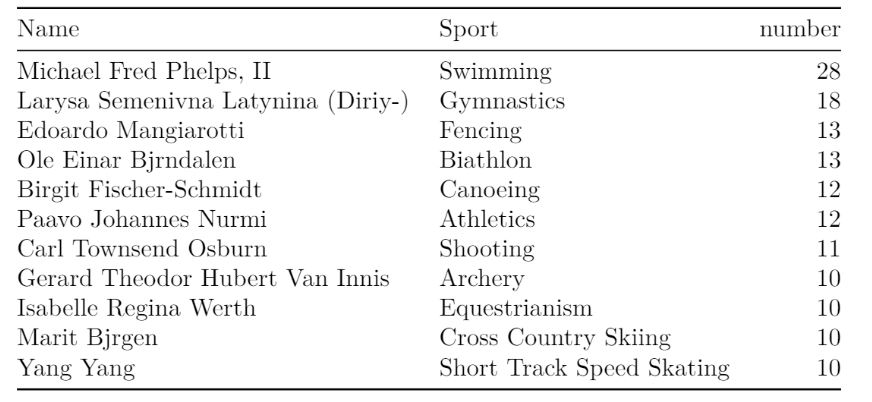

# Olympic History Analytics in R

Looking at 120 years of Olympic history and discovering interesting trends, patterns and visualizing our findings using R.

 

	

## Data Description

We are considering 120 years of Olympic history where we find some interesting trends after analysis. There are two files in our data set:

1.The file *athlete_events.csv* contains 271116 rows and 15 columns. Each row corresponds to an individual athlete competing in an individual Olympic event (athlete-events). The columns are:

- ID : Unique number for each athlete
- Name : Athlete’s name
- Sex : M or F
- Age : Integer
- Height : In centimeters
- Weight : In kilograms
- Team : Team name
- NOC : National Olympic Committee 3-letter code
- Games : Year and season
- Year : Integer
- Season : Summer or Winter
- City : Host city
- Sport : Sport
- Event : Event
- Medal : Gold, Silver, Bronze, or NA

2.The file *noc_regions.csv* contains 230 rows and 3 columns. Each row shows the special NOC code that denotes a region/country along with notes. The columns are:

- NOC : National Olympic Committee 3 letter code
- Country name : matches with regions in map_data(“world”)
- Notes : Special notes if any

## Data Acquisition

We acquire the data set from [Kaggle](https://www.kaggle.com/heesoo37/120-years-of-olympic-historyathletes-and-results?select=athlete_events.csv)

## Analytical Questions

### Trend analysis of Top 10 regions with the highest number of medals between 1896 - 1956 & 1957 - 2016

	

**Observation:** USA remains the region with the highest number of Medals in the combined history of 120 years in Olympics. Russia, a new inclusion in the top 10 took 2nd position in the later half. Germany moved into the 3rd position in the second half while UK and France slipped from 2nd and 3rd to 8th and 9th position. There are new countries in the later half such as Australia, Canada and Japan which where not in the top 10 for the earlier history of Olympics.

### Medals won by Males/Females over Time

	

**Observation:** From the graph, we can see that there is a gradual increase in the number of medals won by female athletes over time. Male athletes tend to outnumber female athletes but their numbers also keep fluctuating over time. After the years 1994, the summer and winter Olympic games were split and held during seperate years, hence why the graph shows different points.

### Finding the most participated sport in Olympics every year

	
	 
	

**Observation**: This table shows that Athletics has remained the most contested sport in 120 years of Olympics. Art Competitions were the highest participated Olympic Sport in 1932 before it was removed from the Olympics. As the Olympic Winter and Summer games were seperated into different years from 1994, Cros Country Skiing emerged as the most participated game held during the Winters.

### In which Olympic year did a particular country win a medal for the first time for a particular sport

	
	 
	

**Observation:** From the above table we can see the first year in which each country won a medal for football. The first countries to win medals for football are UK,Belgium,France and Netherlands and all these countries are from Europe.

### Trend analysis per sport per country for the gap between medals for Football

	

**Observation:** The gap between first and last medals for football for each country is displayed. Canada has the largest gap of 112 years while Czech Republic has the smallest gap of 16 years.

### Comparison of medals won by regions in Summer & Winter	

	

**Observation:** In Summer USA takes the top spot in the number of medals won and Russia stood second. When it comes to winter the positions are interchanged. Germany remains constant in both summer and winter. The graph has a uniform increase in the number of medals in summer but its not a uniform increase in winter, So this means that the winter games are more competitive while summer has a distinctive winner. 

### Top 10 Host cities with the highest participation

	

**Observation:**  The top ten cities with the highest participation are Sydney(2000), Atlanta(1996), Rio de Janeiro(2016),Beijing(2008), Athina(2004), Barcelona(1992), London(2012),Seoul(1988),Munich(1972),Los Angeles(1984)

### Top 10 athletes with the highest participation in the Olympics

	

**Observation:** As we can see nearly all the top 10 athletes participated in the Olympics more than 30 times and the one with the most is Heikki Ilmari Savolainen with 39 times

### Athletes with the most number of medals in each sport

	

**Observation:** For Swiming, Michael Fred Phelps, II won the most number of medals(28) and there are 11 players with the number of medals equal or more than 10 in different sports.

## Report
We cleaned, wrangled, structured and enriched our data to make it ready for exploratory data analysis (EDA). We then data analysis on the above business questions and visualized the results in terms.
View the full report [here](https://github.com/Thomas-George-T/Olympic-History-Analytics-in-R/blob/main/Olympic-History.pdf)

## Summary
After careful analysis of Olympic history worth 120 years. We were able to decipher lot of emerging patterns and visualize them. We were able to gain valuable insights about our business questions through various plots.
